# MockGPT – AI-Powered Mock Interview Platform

MockGPT is a MERN stack-based AI mock interview platform designed to simulate realistic interview environments. It leverages OpenAI, Deepgram, and AWS Polly to provide interactive conversations with speech-to-text (STT) and text-to-speech (TTS) capabilities.

## 🚀 Features

- 🧠 AI-Powered Interview Simulation (OpenAI GPT-based)
- 🎤 Real-time Speech-to-Text using Deepgram
- 🔊 Text-to-Speech using AWS Polly
- 🔁 Live conversation loop using WebSockets (Socket.IO)
- 📋 Transcript and outcome generation
- 🔐 User Authentication with JWT
- 📊 Interview stats & dashboard (upcoming)

---

## 🛠 Tech Stack

- **Frontend:** React, Tailwind CSS, Socket.IO Client  
- **Backend:** Node.js, Express.js, Socket.IO Server, TypeScript  
- **Database:** MongoDB  
- **STT:** Deepgram  
- **TTS:** AWS Polly  
- **AI Engine:** OpenAI API  

---

## 📸 Screenshots

### 🏠 Homepage Screens

#### Homepage – View 1
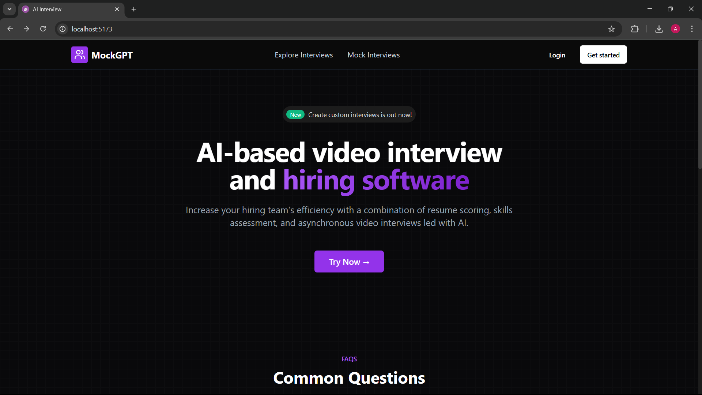

#### Homepage – View 2
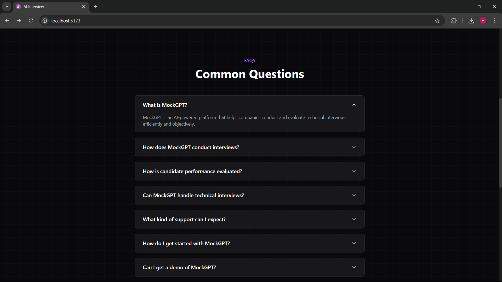

#### Homepage – View 3
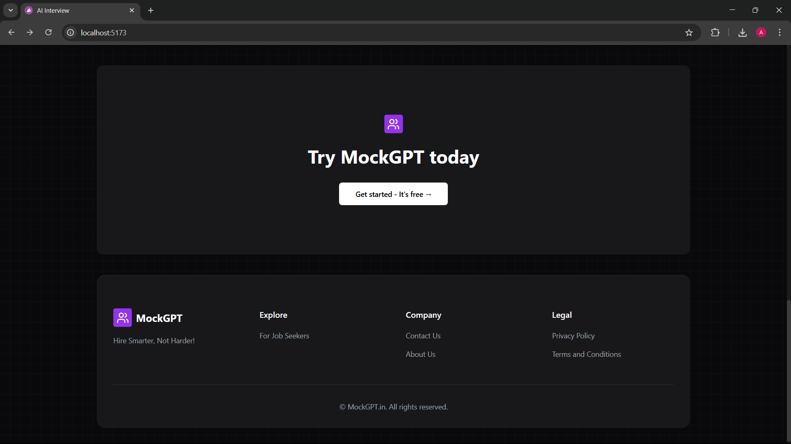

---

### 🔐 Authentication

#### Sign In Page
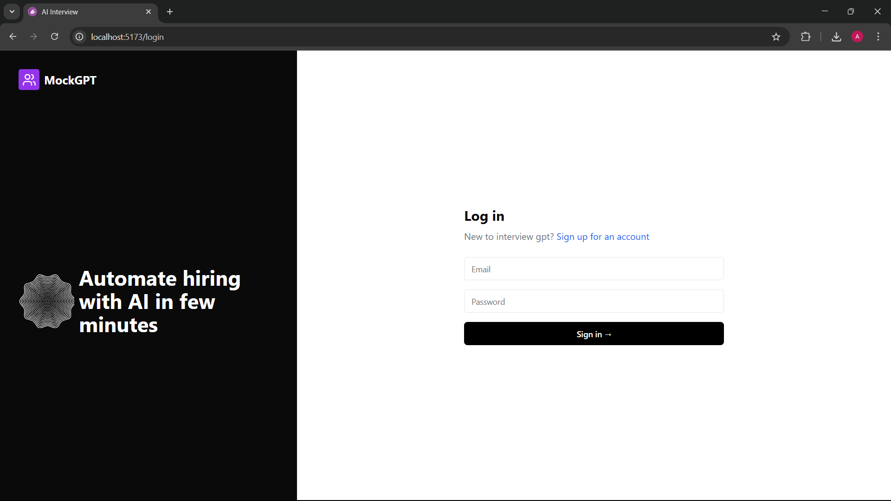

#### Signup Page
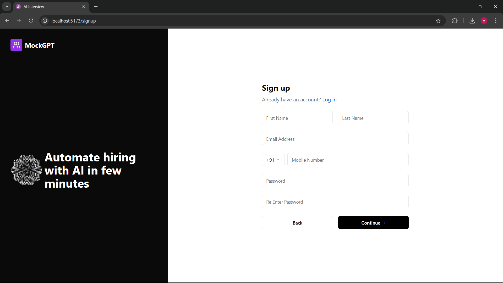

---

### 📊 Dashboard

#### Main Dashboard
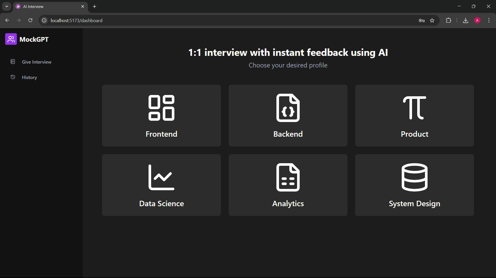

---

### 🎯 Pre-Interview Screen

#### Role & Mode Selection
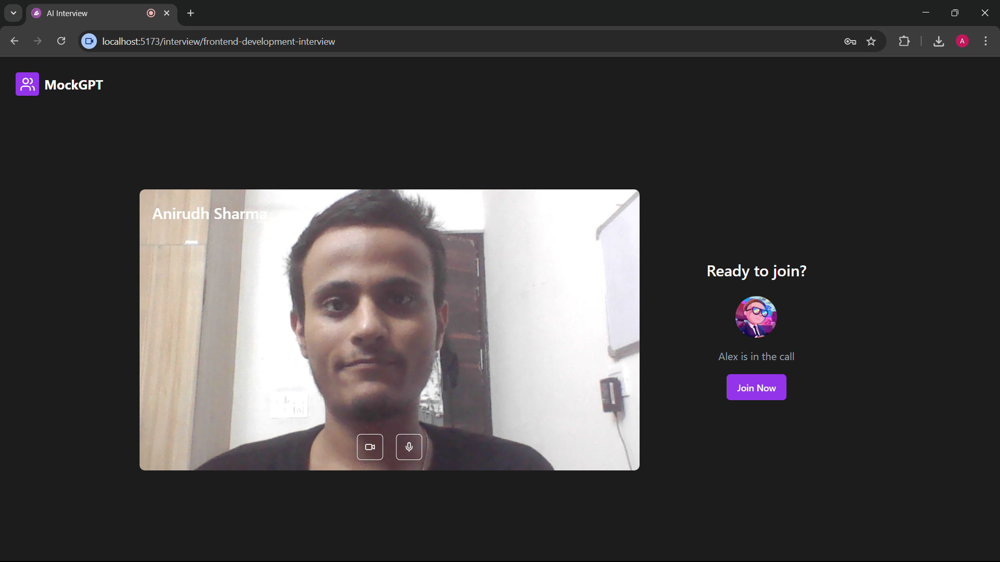

---

### 🧑‍💼 Interview Interface

#### Interview in Progress – View 1
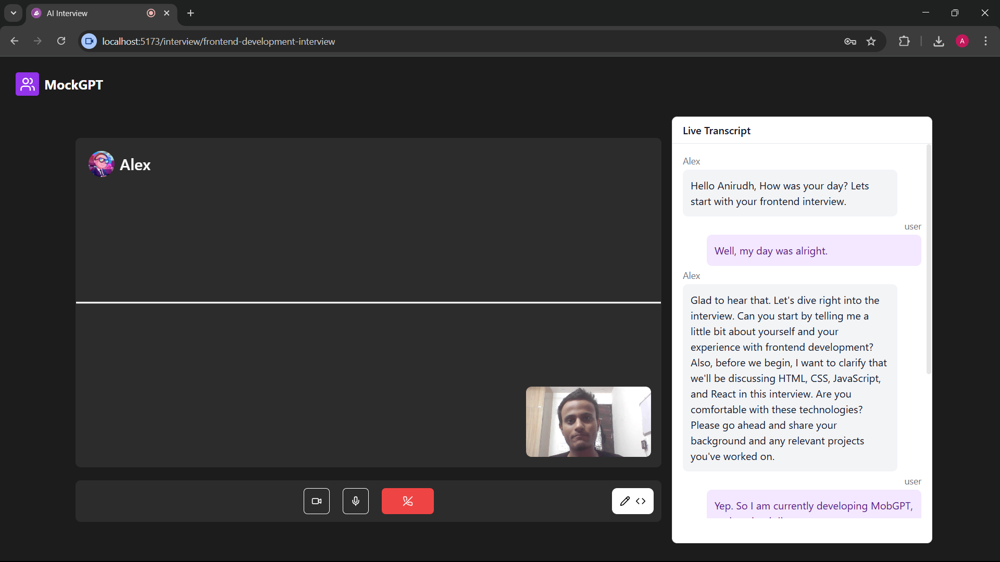

#### Interview in Progress – View 2
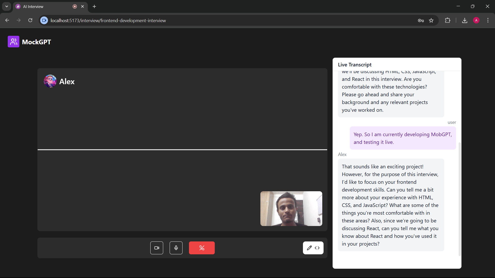

---

### 💻 Code Editor

#### Coding Round Editor
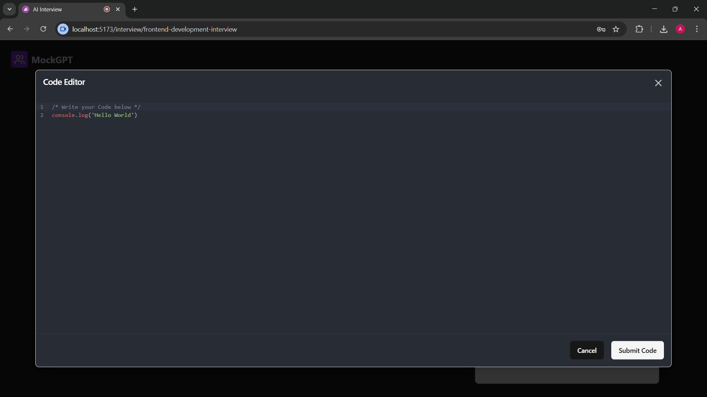

---

### 📈 Feedback & Stats

#### Feedback – View 1
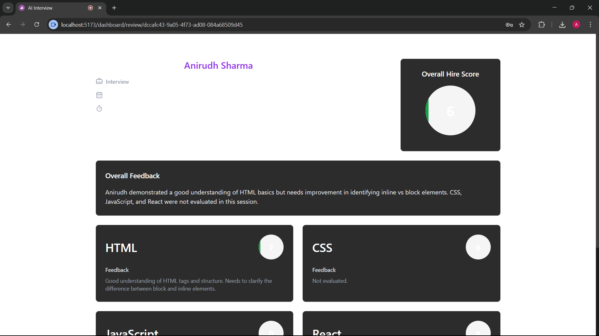

#### Feedback – View 2
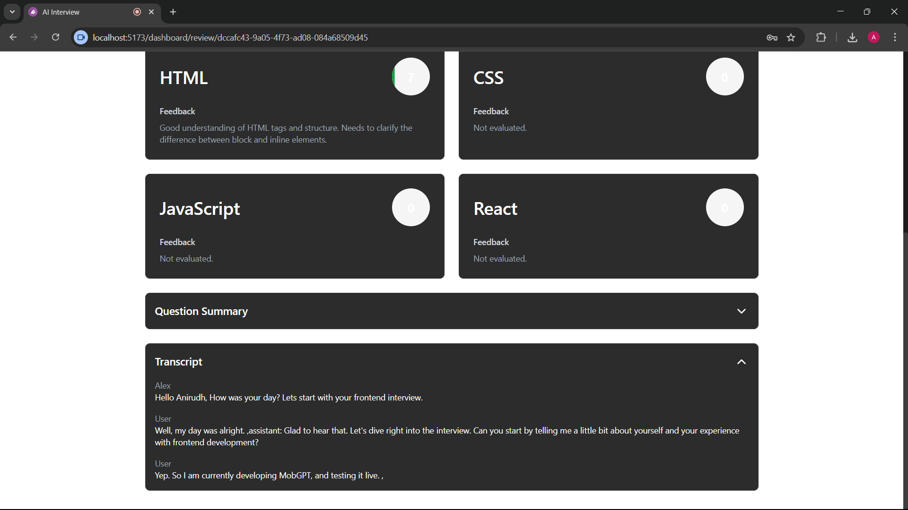
